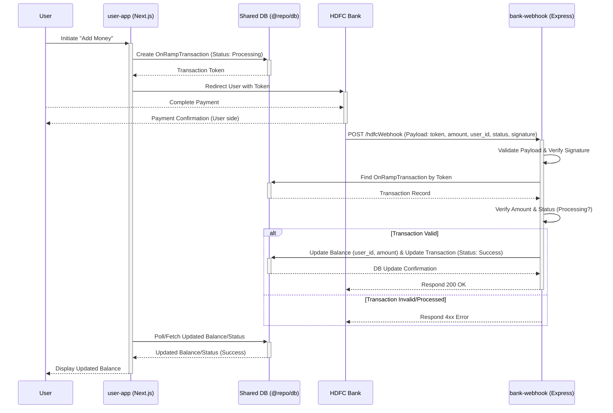

# Documentation: `user-app` and `bank-webhook` Interaction

This document outlines the architecture and interaction flow between the `user-app` and the `bank-webhook` service for handling payment on-ramping via HDFC Bank.

## 1. `user-app` Overview

*   **Description:** The primary user-facing application, built with Next.js.
*   **Role:** Initiates "add money" or similar on-ramp transactions.
*   **Process:** Creates an initial transaction record in the shared database (likely `OnRampTransaction` table) with a "Processing" status. It then redirects the user to the HDFC Bank payment portal, passing along necessary transaction identifiers (like a unique token).

## 2. `bank-webhook` Overview

*   **Description:** A dedicated, independent backend service built with Express/Node.js, designed for reliability.
*   **Purpose:** Listens for incoming webhook notifications from HDFC Bank, specifically on the `/hdfcWebhook` endpoint.
*   **Responsibilities:**
    *   Validates the structure of the incoming webhook payload.
    *   Verifies the webhook's signature using a pre-configured shared secret (`HDFC_WEBHOOK_SECRET`) to ensure the request originates from HDFC Bank and hasn't been tampered with.
    *   Retrieves the corresponding transaction record from the database using the token provided in the webhook payload.
    *   Checks that the transaction amount matches the original record and that the transaction hasn't already been successfully processed.
    *   If all checks pass and the incoming status indicates a successful payment (often represented initially as "Processing" by the bank before final confirmation), it securely updates the user's balance in the database (likely `Balance` table) and marks the `OnRampTransaction` record as "Success".

## 3. Interaction Flow

The step-by-step process is as follows:

1.  **Initiation:** User clicks "Add Money" (or similar) in `user-app`.
2.  **Record Creation:** `user-app` creates an `OnRampTransaction` record (status: Processing) in the shared database and gets a unique transaction token.
3.  **Redirection:** `user-app` redirects the user to HDFC Bank's payment portal, including the token.
4.  **Payment:** User completes the payment process directly with HDFC Bank.
5.  **Webhook Notification:** HDFC Bank sends an asynchronous POST request (webhook) to the `bank-webhook` service's `/hdfcWebhook` endpoint containing transaction details (token, amount, user identifier, status, signature).
6.  **Receipt & Validation:** `bank-webhook` receives the request, validates the payload structure, and verifies the cryptographic signature.
7.  **DB Lookup:** `bank-webhook` finds the matching `OnRampTransaction` in the database using the token.
8.  **Processing & Update:** After successful verification (amount match, status check), `bank-webhook` performs a database transaction to:
    *   Increment the user's balance in the `Balance` table.
    *   Update the `OnRampTransaction` status to "Success".
9.  **User Feedback:** `user-app` (through methods like polling the database, WebSocket updates, or the user refreshing) reads the updated balance/transaction status and reflects the successful deposit to the user interface.

## 4. Diagrams

### Sequence Diagram



### Flowchart Diagram

```mermaid
graph TD
    A[User initiates "Add Money" in user-app] --> B{user-app creates OnRampTransaction (Processing) in DB};
    B --> C[user-app redirects User to HDFC Bank];
    C --> D{User completes payment};
    D --> E[HDFC Bank sends Webhook POST to bank-webhook];
    E --> F{bank-webhook receives request};
    F --> G{Validate Payload & Signature};
    G -- Valid --> H{Find Transaction by Token in DB};
    G -- Invalid --> X[Respond 401 Invalid Signature];
    H -- Found --> I{Check Status == Processing?};
    H -- Not Found --> Y[Respond 404 Not Found];
    I -- Yes --> J{Verify Amount};
    I -- No --> Z[Respond 409 Already Processed/Invalid];
    J -- Match --> K{Update Balance & Transaction Status (Success) in DB};
    J -- Mismatch --> AA[Respond 400 Amount Mismatch];
    K --> L[Respond 200 OK];
    M[user-app polls/fetches updated status/balance] --> N[Display updated balance to User];

    subgraph Webhook Logic
        F; G; H; I; J; K; L; X; Y; Z; AA;
    end

    subgraph User App Flow
        A; B; C; M; N;
    end

    subgraph Bank Interaction
        D; E;
    end